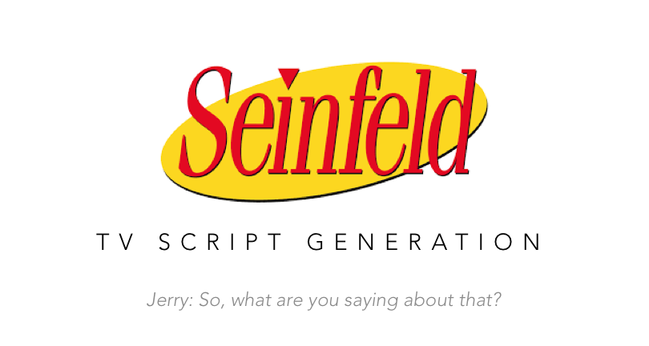

# *Seinfeld* Script Generation



This project is abbout learning from TV scripts and then automatically generate the 'fake' script. The scripts are from **Seinfeld**, an American [sitcom](https://en.wikipedia.org/wiki/Sitcom) television series created by [Larry David](https://en.wikipedia.org/wiki/Larry_David) and [Jerry Seinfeld](https://en.wikipedia.org/wiki/Jerry_Seinfeld) for [NBC](https://en.wikipedia.org/wiki/NBC). 


## Algorithms

1. **Preprocess** 
   * Tokenize the text (also turn punctuation into a token)
   * Create look up table (mapping text to id, just so the text could be fed into the model)
   * Drop the notice at the beginning of the txt file
   * Lowercase conversion to reduce complexity
   * Generate inputs and label based on sequential order of text, and sequence length set in the program
   * Turn inputs, label into a data loader
2. **Model**
   * Embedding layer (Word2Vec): reduce the dimension of text data `embedding_dim=300`
   * LSTM layer: captures the relationships between words in script sequences `n_layers=3` ,`hidden_dim=512`,`dropout=0.5`
   * Linear layer: generate predictions for next words
3. **Training**
   * Optimizer: Adam, `lr=0.001`
   * Criterion: Cross entropy loss between the predicted next words and the label.


## Usage

1. **To train the model:**

   ```
   python3 main.py --data_dir './Seinfeld_Scripts.txt' --num_epochs 12
   ```

   Below are the configurable params:

   | Param                | Default | Type  | Note                                                         |
   | -------------------- | ------- | ----- | ------------------------------------------------------------ |
   | sequence_length      | 50      | int   | By default, the algorithm predict the next word based on previous 50 words |
   | batch_size           | 250     | int   | -                                                            |
   | num_epochs           | 12      | int   | -                                                            |
   | learning_rate        | 0.001   | float | -                                                            |
   | embedding_dim        | 300     | int   | -                                                            |
   | hidden_dim           | 512     | int   | The hidden dimension of the LSTM layer                       |
   | n_layers             | 3       | int   | The number of LSTM layers, typically no more than 3          |
   | show_every_n_batches | 500     | int   | The frequency to show log info (current epoch, loss)         |
   | data_dir             | -       | str   | The path to the data file                                    |

2. **To generate new text**

   ```
   python3 generate.py --prime_word 'life' --gen_length 600
   ```

   Below are the configurable params:

   | Param           | Default | Type | Note                                                         |
   | --------------- | ------- | ---- | ------------------------------------------------------------ |
   | gen_length      | 300     | int  | The number of words to be generated                          |
   | prime_word      | love    | str  | The word to start with                                       |
   | top_k           | 5       | int  | The number of candidates to choose from for  the prediction of each single word. The smaller this value is, the more grammatically rigorous our prediction will be. The larger this value is, the more variation will be detected in our prediction |
   | model_dir       | -       | str  | The path contains the model, you can set it to the pretrained model in this repo. |
   | sequence_length | 50      | int  | Same as in `main.py`                                         |


## Results

1. We set the starting word to be *life*, and top_k to be *5*, and get the following result.

   ```
   life!
   
   jerry: i can't believe it!
   
   kramer:(to elaine) hey, hey, you know i got a little problem for you.
   
   jerry: i think you can do it again. i'm gonna get a cab.
   
   kramer: hey, you got the ticket with the whole walk list?
   
   elaine: no, i was just wondering what happened to you.(george enters.
   
   kramer: oh, hi!
   
   jerry: hey, how's it going?
   
   
   elaine: alex, scott, i was just trying to get..)
   
   jerry: what is tuscany about, up?
   
   george: what are we gonna going me shade?
   
   jerry: i going to the bathroom.
   
   george: enzo?, i can't believe this, jerry.
   
   elaine: you know, i know, i have a great gas for a, i think i can do it.
   
   newman: you want some money? you know what i mean?
   
   jerry: well, i'm gonna get you.
   
   kramer: no. i'm not a psycho. i was wondering if you don't mind, i don't want any money anymore.
   
   elaine: you know,,.
   
   
   jerry: no.
   
   elaine: i know.
   
   jerry: what?
   , i got the idea.
   
   elaine: you know up?
   
   jerry: well, i don't pushed it.
   ,, but i know, i know?
   , elaine: what?,, i don't know.,
   ```

2. To examine how `top_k` influence the output, we decrease it to be 3 and generated the following results. 

   ```
   life.
   
   elaine: yeah, but you should have been a stickler...(kramer looks at the walls and smokes)...(jerry stops laughing)
   
   elaine:(to jerry) hey, you know, i don't even know how much opium?...
   
   jerry: so, what are you saying about that?
   
   kramer: well,,, i don't know. i mean, i know, i know.
   . jerry: i know shade, but i was opium.
   
   george: you know,, i'm going to get.
   
   elaine:
   , frankly,, i can't believe you said that...
   
   jerry: i going to the dark room, i gotta go.
   
   kramer:(to jerry) well, i gotta go..(kramer leaves)
   
   jerry: hey, george, what are you doing?
   
   george: what is this?
   
   jerry: i don't know.
   
   george: what? what is it?
   
   jerry: well, i'm going.
   
   george: oh yeah, i'm enzo shade.
   
   jerry: oh.
   
   elaine: i, i'm going?
   
   newman: i'm address with you,, i know..,,....,
   
   jerry: you know, i?...
   
   elaine: you mean you know...
   , frankly, i don't know.
   
   elaine: oh, yeah. i don't think so?
   
   jerry: yeah...
   
   george:, what
   ```

   

## Conclusions

1. This algorithms successfully captures the structure of the TV script, including the layout and format (starting with name and colon)

2. There are some interesting scripts:

   > no. i'm not a psycho. i was wondering if you don't mind, i don't want any money anymore.

   > jerry: so, what are you saying about that?

   > frankly,, i can't believe you said that...

3. When we decrease `top_k` from 5 to 3, the result is more grammatically correct, but prone to collapse into short phrases:

   > i don't know. i mean, i know, i know.


## Next

1. Improve the embedding matrix using technologies including
   * Negative sampling (decrease training time)
   * Down sample high frequent words
   * Lemmatization (reduce the input dimension)
2. Improve the training epochs
3. Providing more words to start with, potentially it will further influence the topic of the script


## Acknowledgement

The data of this project is from Udacity Deep Learning Nano Degree program.

The `generate()` function in `generate.py` also came from Udacity.

